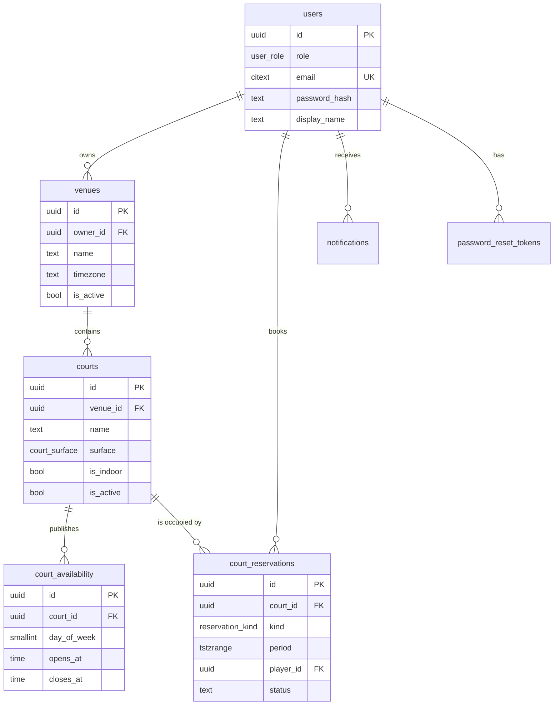

# Deuce — Database Design

**Status:** Draft for review
**Engine:** PostgreSQL

> Derived from `BUSINESS_REQUIREMENTS.md`. Every table here exists to serve a numbered business rule, and the rules that matter most are the ones about conflicts.

---

## 1. Design principles

1. **The database enforces what must never be wrong.** Availability rules and booking limits can live in application code; *two people on one court* cannot. If an invariant would be catastrophic to violate, it belongs in a constraint, not in a code path.
2. **Nothing is ever deleted.** Courts and venues deactivate; bookings cancel. History is evidence, and evidence you can delete isn't evidence.
3. **All instants are `timestamptz`; all opening hours are local wall-clock `time`.** These are genuinely different kinds of thing and conflating them is the classic scheduling bug.
4. **Store the range, not two columns.** A booking occupies a period. Postgres has a first-class type for that, and it unlocks the constraint that makes the whole design work.

---

## 2. Entity relationships



---

## 3. The central decision: one occupancy table, or two?

This is the decision the whole schema turns on, so it's worth settling first.

Two things can occupy a court: **a player's booking** and **an owner's maintenance block**. They must not overlap each other, and neither must overlap itself. That's three conflict rules:

- booking vs booking (BR-19 — the absolute one)
- booking vs block (BR-31 — can't book a blocked court)
- block vs block (housekeeping)

### Option A — separate `bookings` and `court_blocks` tables

Natural modelling: they *are* different concepts, with different lifecycles and different fields. A booking has a player; a block has a reason.

The problem is that **no single constraint can span two tables.** You can stop bookings overlapping bookings, and blocks overlapping blocks, but "this booking doesn't land inside a block" has to be a `SELECT` before the `INSERT` — and that's precisely the check-then-act race that produces double-bookings. You'd be pushing the hardest invariant back into application code after having gone to the trouble of getting the easy one right.

### Option B — one `court_reservations` table *(chosen)*

Bookings and blocks are rows in one table, discriminated by `kind`. Then **a single exclusion constraint enforces all three rules at once**:

```sql
EXCLUDE USING gist (court_id WITH =, period WITH &&) WHERE (status = 'active')
```

No overlapping *anything* on a court, whatever it is, enforced by the database for every writer forever.

**What it costs:** one table holds two concepts, so some columns are nullable per `kind` (`player_id` for bookings, `reason` for blocks). That's a mild polymorphic-table smell, and `CHECK` constraints have to keep the shapes honest.

**Why it wins anyway:** the thing being modelled here genuinely is one thing — *an interval during which this court is spoken for*. Whether it's spoken for by a player or by a repair crew is an attribute of the occupancy, not a different kind of occupancy. The table is named for what it actually represents, and the constraint falls out for free.

**It also makes the block-cancels-bookings flow (BR-32) clean.** Inserting a block over live bookings would violate the constraint, so the only way it can succeed is to cancel them first — in one transaction:

```sql
BEGIN;
  UPDATE court_reservations SET status = 'cancelled', ...
   WHERE court_id = $1 AND status = 'active' AND period && $2;
  INSERT INTO court_reservations (kind, ...) VALUES ('block', ...);
COMMIT;
```

The database makes it impossible to block a court and *forget* to deal with the bookings on it. The business rule is structurally enforced rather than remembered.

---

## 4. Schema

### 4.1 Extensions and types

```sql
CREATE EXTENSION IF NOT EXISTS btree_gist;   -- scalar (=) inside a gist exclusion constraint
CREATE EXTENSION IF NOT EXISTS citext;       -- case-insensitive email
CREATE EXTENSION IF NOT EXISTS pgcrypto;     -- gen_random_uuid()

CREATE TYPE user_role          AS ENUM ('player', 'owner');
CREATE TYPE court_surface      AS ENUM ('clay', 'hard', 'grass', 'carpet');
CREATE TYPE reservation_kind   AS ENUM ('booking', 'block');
CREATE TYPE reservation_status AS ENUM ('active', 'cancelled');

CREATE TYPE timerange AS RANGE (subtype = time);   -- no built-in equivalent; used by availability
```

### 4.2 `users`

One table for both roles. Since an account is exactly one role for life (BR-2), the role is a column and the exclusivity rule enforces itself: one row, one role, no way to express the forbidden state.

```sql
CREATE TABLE users (
    id            uuid PRIMARY KEY DEFAULT gen_random_uuid(),
    role          user_role   NOT NULL,
    email         citext      NOT NULL UNIQUE,
    password_hash text        NOT NULL,
    display_name  text        NOT NULL CHECK (length(trim(display_name)) > 0),
    is_active     boolean     NOT NULL DEFAULT true,
    created_at    timestamptz NOT NULL DEFAULT now(),
    updated_at    timestamptz NOT NULL DEFAULT now(),

    -- redundant on its own, but it is what lets other tables reference *a user of a given role*
    UNIQUE (id, role)
);
```

**That trailing `UNIQUE (id, role)` is the interesting line.** On its own it's pointless — `id` is already unique. Its purpose is to be a target for composite foreign keys, so that other tables can require not just *a user* but *a user of the right role*. See §4.6.

### 4.3 `venues`

```sql
CREATE TABLE venues (
    id         uuid PRIMARY KEY DEFAULT gen_random_uuid(),
    owner_id   uuid        NOT NULL,
    owner_role user_role   NOT NULL GENERATED ALWAYS AS ('owner') STORED,
    name       text        NOT NULL CHECK (length(trim(name)) > 0),
    address    text        NOT NULL,
    timezone   text        NOT NULL,              -- IANA, e.g. 'Asia/Tokyo'
    is_active  boolean     NOT NULL DEFAULT true,
    created_at timestamptz NOT NULL DEFAULT now(),
    updated_at timestamptz NOT NULL DEFAULT now(),

    FOREIGN KEY (owner_id, owner_role) REFERENCES users (id, role)
);

CREATE INDEX venues_owner_idx ON venues (owner_id) WHERE is_active;
```

`owner_role` is a generated column permanently equal to `'owner'`, which makes the composite foreign key resolve to *"a user whose role is owner"*. **A player cannot be inserted as a venue owner — not by the API, not by a migration, not by someone with `psql`.** BR-43 stops being a code path and becomes a schema property.

**`timezone` is validated in the application, not the database.** Postgres needs `CHECK` expressions to be immutable, and every route to validating a timezone name (`AT TIME ZONE`, `pg_timezone_names`) is either stable-not-immutable or a subquery. Worth knowing *why* rather than discovering it mid-migration — and worth saying out loud, because "I wanted this in a constraint and here's why it can't be" is a better answer than not having tried.

### 4.4 `courts`

```sql
CREATE TABLE courts (
    id         uuid PRIMARY KEY DEFAULT gen_random_uuid(),
    venue_id   uuid          NOT NULL REFERENCES venues (id) ON DELETE RESTRICT,
    name       text          NOT NULL CHECK (length(trim(name)) > 0),
    surface    court_surface NOT NULL,
    is_indoor  boolean       NOT NULL DEFAULT false,
    is_active  boolean       NOT NULL DEFAULT true,
    created_at timestamptz   NOT NULL DEFAULT now(),
    updated_at timestamptz   NOT NULL DEFAULT now(),

    UNIQUE (venue_id, name)          -- "Court 1" twice at one venue is a data-entry error
);

CREATE INDEX courts_venue_idx ON courts (venue_id) WHERE is_active;
```

`ON DELETE RESTRICT` throughout, deliberately. Principle 2: venues and courts deactivate, they don't disappear, because bookings that reference them must stay readable.

### 4.5 `court_availability`

Recurring weekly windows (BR-10), in venue-local wall-clock time. Several rows per court per day are allowed, for a court open mornings and evenings but closed midday.

```sql
CREATE TABLE court_availability (
    id          uuid PRIMARY KEY DEFAULT gen_random_uuid(),
    court_id    uuid     NOT NULL REFERENCES courts (id) ON DELETE CASCADE,
    day_of_week smallint NOT NULL CHECK (day_of_week BETWEEN 0 AND 6),   -- 0 = Sunday, matches EXTRACT(dow)
    opens_at    time     NOT NULL,
    closes_at   time     NOT NULL,

    CONSTRAINT availability_window_ordered CHECK (closes_at > opens_at),
    CONSTRAINT availability_hour_aligned CHECK (
        EXTRACT(minute FROM opens_at)  = 0 AND EXTRACT(second FROM opens_at)  = 0 AND
        EXTRACT(minute FROM closes_at) = 0 AND EXTRACT(second FROM closes_at) = 0
    ),

    -- two windows on the same day must not overlap
    EXCLUDE USING gist (
        court_id    WITH =,
        day_of_week WITH =,
        timerange(opens_at, closes_at) WITH &&
    )
);

CREATE INDEX court_availability_lookup_idx ON court_availability (court_id, day_of_week);
```

`CASCADE` here rather than `RESTRICT`: availability is configuration belonging to a court, not history. If a court were ever genuinely deleted, its opening hours have no independent meaning.

The hour-alignment check works because `EXTRACT` on a plain `time` is immutable — unlike on a `timestamptz`, where it depends on the session timezone. This distinction comes up again in §4.6.

### 4.6 `court_reservations` — the core table

```sql
CREATE TABLE court_reservations (
    id       uuid               PRIMARY KEY DEFAULT gen_random_uuid(),
    court_id uuid               NOT NULL REFERENCES courts (id) ON DELETE RESTRICT,
    kind     reservation_kind   NOT NULL,
    status   reservation_status NOT NULL DEFAULT 'active',
    period   tstzrange          NOT NULL,

    -- bookings only
    player_id   uuid,
    player_role user_role GENERATED ALWAYS AS ('player') STORED,

    -- blocks only
    reason text,

    cancelled_at        timestamptz,
    cancellation_reason text,
    created_by          uuid        NOT NULL REFERENCES users (id) ON DELETE RESTRICT,
    created_at          timestamptz NOT NULL DEFAULT now(),
    updated_at          timestamptz NOT NULL DEFAULT now(),

    CONSTRAINT reservation_period_bounded CHECK (
        lower(period) IS NOT NULL AND upper(period) IS NOT NULL AND NOT isempty(period)
    ),
    CONSTRAINT reservation_shape CHECK (
        (kind = 'booking' AND player_id IS NOT NULL AND reason IS NULL) OR
        (kind = 'block'   AND player_id IS NULL     AND reason IS NOT NULL)
    ),
    CONSTRAINT reservation_cancelled_consistently CHECK (
        (status = 'cancelled') = (cancelled_at IS NOT NULL)
    ),

    FOREIGN KEY (player_id, player_role) REFERENCES users (id, role),

    -- ★ the constraint the entire product rests on
    CONSTRAINT court_reservations_no_overlap EXCLUDE USING gist (
        court_id WITH =,
        period   WITH &&
    ) WHERE (status = 'active')
);
```

**Three things worth pointing at:**

**The exclusion constraint** is the whole design in four lines. `court_id WITH =` needs `btree_gist` (gist doesn't handle plain equality alone); `period WITH &&` is the range-overlap operator. Together: no two active rows for one court may overlap in time. It covers booking-vs-booking, booking-vs-block and block-vs-block in one statement.

**The partial `WHERE (status = 'active')`** is what makes cancellation free. A cancelled booking stays in the table for history (BR-28) but stops occupying the court the instant its status flips — no deletion, no tombstone rows, no cleanup job. One `UPDATE` releases the slot.

**`player_role` is generated and constant**, mirroring §4.3: the composite FK means only a user with role `player` can be a booking's player. And because Postgres foreign keys default to `MATCH SIMPLE`, a block — which has `player_id IS NULL` — skips the check entirely rather than needing a special case.

#### What the database deliberately does *not* enforce here

Two booking rules that look like they belong in `CHECK` constraints, and can't be:

| Rule | Why not |
|---|---|
| A booking is exactly one hour (BR-18) | `upper(period) = lower(period) + interval '1 hour'` relies on `timestamptz + interval`, which is **stable, not immutable** — Postgres rejects it in a `CHECK`. Needs a trigger, or application enforcement. |
| A booking starts on the hour | "On the hour" means *in the venue's local time*, and the timezone lives in `venues`, two joins away. **No `CHECK` can see it.** It is inherently cross-table and therefore inherently application-level. |

This is a genuinely good thing to have an answer for, because it's the honest boundary of the "push it into the database" argument. The critical invariant — *no overlaps* — is enforced absolutely. The shape invariants are not, because the engine can't, and knowing exactly where that line falls is more useful than insisting everything belongs on one side of it.

#### Indexes

```sql
-- "my bookings", newest first
CREATE INDEX reservations_player_idx
    ON court_reservations (player_id, lower(period) DESC)
    WHERE kind = 'booking';

-- owner's day view, and the availability search
CREATE INDEX reservations_court_period_idx
    ON court_reservations USING gist (court_id, period)
    WHERE status = 'active';
```

The second is partly redundant with the exclusion constraint's own index, which is itself a gist index on the same columns with the same predicate. **Start with just the constraint and measure before adding it** — a duplicate index costs write throughput on the hottest table in the system.

### 4.7 `notifications`

Serves BR-38: players learn their booking was cancelled by an owner.

```sql
CREATE TABLE notifications (
    id         uuid PRIMARY KEY DEFAULT gen_random_uuid(),
    user_id    uuid        NOT NULL REFERENCES users (id) ON DELETE CASCADE,
    kind       text        NOT NULL,     -- e.g. 'booking_cancelled_by_owner'
    payload    jsonb       NOT NULL,     -- venue, court, slot, reason (BR-39)
    read_at    timestamptz,
    created_at timestamptz NOT NULL DEFAULT now()
);

CREATE INDEX notifications_unread_idx
    ON notifications (user_id, created_at DESC)
    WHERE read_at IS NULL;
```

Written **in the same transaction** as the cancellation. A player whose game is cancelled without being told is the worst failure this system can produce short of a double-booking, so the notification must not be able to fail independently of the cancellation that caused it.

### 4.8 `password_reset_tokens`

```sql
CREATE TABLE password_reset_tokens (
    token_hash text PRIMARY KEY,            -- the raw token is never stored
    user_id    uuid        NOT NULL REFERENCES users (id) ON DELETE CASCADE,
    expires_at timestamptz NOT NULL,
    used_at    timestamptz,
    created_at timestamptz NOT NULL DEFAULT now()
);
```

Hashed, single-use, expiring. A reset token is a temporary password and is stored with the same care.

---

## 5. Key queries

### 5.1 Search: which courts are free at a given hour?

The whole of BR-14 through BR-17 in one query — no N+1 over courts.

```sql
WITH slot AS (
    SELECT tstzrange($1::timestamptz, $1::timestamptz + interval '1 hour', '[)') AS period
)
SELECT c.id, c.name, c.surface, c.is_indoor, v.name AS venue_name, v.address
FROM courts c
JOIN venues v ON v.id = c.venue_id
CROSS JOIN slot s
JOIN court_availability ca
      ON ca.court_id = c.id
     AND ca.day_of_week = EXTRACT(dow FROM lower(s.period) AT TIME ZONE v.timezone)
     AND ca.opens_at  <= (lower(s.period) AT TIME ZONE v.timezone)::time
     AND ca.closes_at >= (upper(s.period) AT TIME ZONE v.timezone)::time
WHERE c.is_active
  AND v.is_active
  AND NOT EXISTS (
      SELECT 1
      FROM court_reservations r
      WHERE r.court_id = c.id
        AND r.status = 'active'
        AND r.period && s.period
  );
```

`AT TIME ZONE v.timezone` converts the instant into the venue's wall clock so it can be compared against published opening hours. **This is the line that makes daylight saving work**: a court open at 07:00 local is open at 07:00 local on both sides of a clock change, and the underlying UTC instant shifts by an hour automatically.

### 5.2 Create a booking

No pre-flight availability check. Availability is verified by the constraint, atomically, at write time.

```sql
INSERT INTO court_reservations (court_id, kind, period, player_id, created_by)
VALUES ($1, 'booking', tstzrange($2, $2 + interval '1 hour', '[)'), $3, $3)
RETURNING id;
```

A conflicting row — another booking *or* a maintenance block — raises SQLSTATE **`23P01` (`exclusion_violation`)**, which the application translates into "that slot has just gone". There is no window between checking and inserting, because there is no check.

### 5.3 Cancel a booking

```sql
UPDATE court_reservations
   SET status = 'cancelled', cancelled_at = now(), updated_at = now()
 WHERE id = $1
   AND player_id = $2                                    -- BR-40: only your own
   AND kind = 'booking'
   AND status = 'active'
   AND lower(period) >= now() + interval '24 hours';     -- BR-25
```

Ownership and the 24-hour rule are both in the `WHERE` clause, so a zero-row result means "not allowed" and the application distinguishes *why* by re-reading the row. **Putting the authorization check in the statement rather than in a preceding `SELECT` closes a time-of-check-to-time-of-use gap** — nothing can change between the check and the write, because they're the same statement.

### 5.4 Block a court, cancelling what's in the way

BR-32, atomically. The cancellations and the block either all happen or none do.

```sql
BEGIN;

UPDATE court_reservations
   SET status = 'cancelled',
       cancelled_at = now(),
       cancellation_reason = $4,
       updated_at = now()
 WHERE court_id = $1
   AND status = 'active'
   AND kind = 'booking'
   AND period && tstzrange($2, $3, '[)')
RETURNING id, player_id, period;          -- drives the notification inserts

INSERT INTO notifications (user_id, kind, payload) VALUES (...);

INSERT INTO court_reservations (court_id, kind, period, reason, created_by)
VALUES ($1, 'block', tstzrange($2, $3, '[)'), $4, $5);

COMMIT;
```

If the `INSERT` still violates the constraint, something else overlapping was created concurrently and the whole transaction rolls back — including the cancellations. **No player is ever told their game is off for a block that didn't happen.**

### 5.5 "My bookings"

```sql
SELECT r.id, r.period, r.status, c.name AS court_name, v.name AS venue_name, v.timezone
FROM court_reservations r
JOIN courts c ON c.id = r.court_id
JOIN venues v ON v.id = c.venue_id
WHERE r.player_id = $1 AND r.kind = 'booking'
ORDER BY lower(r.period) DESC;
```

**There is no `completed` status, deliberately.** A booking is completed when its hour has passed — `status = 'active' AND upper(period) < now()`. Deriving it removes an entire background job and an entire class of "the sweeper didn't run" bug. It would only need to become real state if attendance were ever tracked, and BR-29 says it isn't.

---

## 6. Where each rule is enforced

The table to have ready when someone asks why some rules are in the schema and others aren't.

| Rule | Enforced by | Why there |
|---|---|---|
| No double-booking (BR-19) | **Exclusion constraint** | Catastrophic if violated; must hold for every writer, forever |
| No booking a blocked court (BR-31) | **Same constraint** | Falls out of unifying the two concepts |
| Only players book (BR-42) | **Composite FK** | Unrepresentable beats unwritten |
| Only owners own venues (BR-43) | **Composite FK** | Same |
| One role per account (BR-2) | **Column** | One row, one role — the bad state can't be expressed |
| Cancel only your own (BR-40) | **`WHERE` clause** | Closes the check-then-act gap |
| 24-hour cancellation limit (BR-25) | **`WHERE` clause** | Same |
| No overlapping opening hours | **Exclusion constraint** | Cheap, keeps configuration clean |
| Booking is one hour (BR-18) | Application | `CHECK` can't hold a stable expression |
| Booking starts on the hour | Application | Depends on venue timezone — cross-table |
| Two-week horizon (BR-20) | Application | Policy, changes often, harmless if wrong |
| Max 3 active bookings (BR-23) | Application | Tunable policy; see §7.1 |
| No two courts in one hour (BR-22) | Application | Cross-court query; see §7.1 |

The pattern: **invariants that must never be violated go in the schema; policy that will be tuned goes in code.** Being able to state that distinction cleanly is worth more than either choice on its own.

---

## 7. Known weak points

Worth raising yourself rather than waiting to be asked.

### 7.1 Two rules that are checked, not constrained

BR-23 (max 3 active bookings) and BR-22 (not two courts in the same hour) are both `SELECT`-then-`INSERT` — the exact pattern condemned in §3. A player firing two simultaneous requests can end up with four bookings, or with two courts at 14:00.

Honest position: **this is a real race, and it's tolerated because the consequence is trivial.** One extra booking is not two people on one court. If it needed closing, the options are a `SERIALIZABLE` transaction, an advisory lock on the player id, or a counter table — all of which cost throughput on the hot path to fix a cosmetic problem. *Knowing* it's there and having chosen to leave it is the point.

### 7.2 Exclusion constraints serialise writers on contention

Under a rush for the same slot, gist constraint checking makes conflicting transactions wait. That is exactly what's wanted — but it means booking throughput for a *single popular court* is bounded. Different courts don't contend with each other, so this scales fine on the dimension that matters.

### 7.3 The reservations table only grows

Every booking and block is kept forever. At club scale that's trivial — a 10-court venue generates on the order of 50,000 rows a year. It would eventually want partitioning by time, with the exclusion constraint per-partition, but that's a problem for a scale this system will not reach for years, and building it now would be speculative.

---

## 8. Open questions

1. **Should `court_availability` support date-specific overrides** (a one-off late opening), or is the weekly pattern plus maintenance blocks enough? Blocks cover *closing* early; nothing currently covers *opening* unusually.
2. **Should cancelled bookings free the slot for the original player to rebook immediately?** They currently can, which is a loophole in the 24-hour rule: cancel at 25 hours, rebook, cancel again. Probably harmless without money involved.
3. **Is `notifications` the right home for this**, or should the player simply see cancelled bookings in their list? A table earns its place only if something actually delivers from it.
4. **Does `users` need soft deletion** for account closure, given everything else is soft-deleted?
