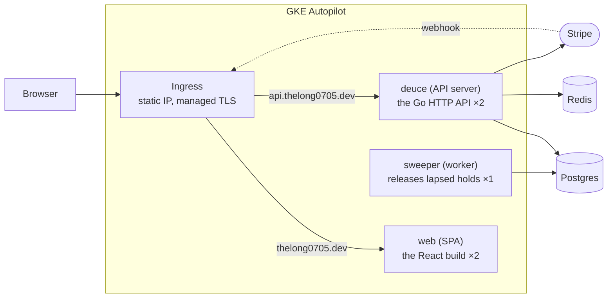
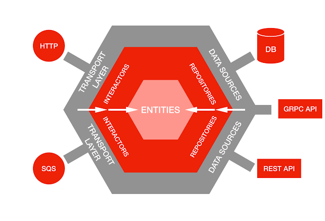
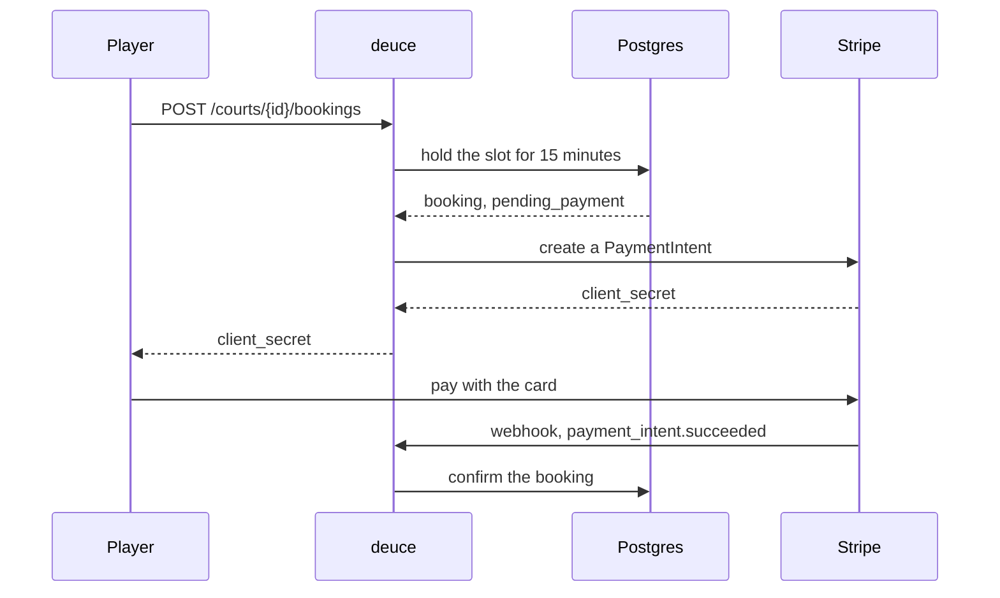

<div align="center">

# 🎾 deuce

**Court booking for tennis venues.**

</div>

<hr />

## 🔗 Live

| What | Where |
| --- | --- |
| 🌐 Web app | <https://thelong0705.dev> |
| 📘 API docs, as Swagger UI | <https://api.thelong0705.dev/docs> |

<hr />

## 📑 Table of contents

- [Overview](#-overview)
- [Architecture](#-architecture)
  - [High level: the running system](#high-level-the-running-system)
  - [Low level: ports and adapters](#low-level-ports-and-adapters)
  - [Project structure](#project-structure)
- [Booking and payment](#-booking-and-payment)
- [Getting started](#-getting-started)
- [Tests](#-tests)
- [API](#-api)
- [Configuration](#-configuration)
- [Deploying](#-deploying)

<hr />

## 🎯 Overview

A player signs up, searches for a court by city, date and time of day, and books
a one-hour slot. Booking holds the slot for fifteen minutes and returns a Stripe
client secret; paying confirms it, and letting the hold lapse puts the slot back.

An owner signs up as an owner, registers a venue in a city with its IANA time
zone, and registers courts under it with opening hours and an hourly price. The
two roles are exclusive: an account is one or the other.

Prices are in VND, and it is the only currency — but it is a type rather than a
string, so adding a second one is a compiler error to work through instead of a
search for literals.

<hr />

## 🏗 Architecture

### High level: the running system

Two Go binaries and a static front end behind one Ingress. Postgres, Redis and
Stripe sit outside the cluster.



| Component | Kind | Runs as | What it does |
| --- | --- | --- | --- |
| `web` | SPA | 2 replicas | serves the built React app as static files |
| `deuce` | API server | 2 replicas | answers every request a browser or Stripe makes |
| `sweeper` | worker | 1 replica | ticks over the database putting back slots nobody paid for |
| `migrate` | one-shot job | by hand | runs golang-migrate against the same database |
| Ingress | routing | one static IP | sends `thelong0705.dev` to the front end and `api.thelong0705.dev` to the API, under one managed certificate |
| Redis | cache | outside the cluster | holds cached sessions and nothing else, so losing it costs a database round trip rather than a booking |

### Low level: ports and adapters

One rule decides where everything goes: **the domain imports nothing from an
adapter.** Interfaces are declared by whoever consumes them, so a use case names
the narrow port it needs and the adapter satisfies it.



The general shape, in this codebase's names: transport is `httpapi`, interactors
are `usecase`, repositories and data sources are the `adapter` packages, and the
entities at the centre are `entity`. Every arrow points inward. `postgres`
imports `usecase`; `usecase` has never heard of `postgres`. That inversion is
what lets the domain be tested without a database, and why `entity` sits at the
centre depending on nothing at all.

The split that matters is `domain` against `adapter`. **`domain/entity`** holds
the rules that are true regardless of how anything is stored or served — whether
a hold has lapsed, which slots a court opens, what an hour costs. It imports
nothing but the standard library, so its tests need no mocks.
**`domain/usecase`** holds the flows, and declares the interfaces it needs as it
needs them: `BookingRepo`, `PaymentGateway`, `SessionCache`. Those interfaces
live with the use case, not with the thing implementing them, which is what
keeps the arrow pointing inward.

Everything under **`adapter`** is a detail that could be swapped. Each one turns
the outside world into domain types and back: `postgres` converts rows and maps
a unique violation to `ErrSlotTaken`, `httpapi` converts JSON and maps error
kinds to status codes, `stripe` converts payment intents. Nothing above them
knows that pgx, chi or Stripe exist.

### Project structure

```groovy
.
├── api/                  the OpenAPI spec, served by the API itself at /docs
├── cmd/
│   ├── deuce/            the API binary, and the only place the pieces are wired together
│   └── sweeper/          a worker that puts back the slots nobody paid for
├── db/postgres/
│   ├── migration/        numbered SQL, applied by golang-migrate
│   ├── query/            the SQL sqlc generates typed Go from
│   └── seed.sql          two owners with courts, two players to book them
├── deploy/k8s/           Deployments, Service, Ingress, certificate, and the migration Job
├── docs/                 images used by this README
├── e2e/                  end-to-end tests, behind a build tag so they stay out of the usual run
├── internal/
│   ├── adapter/
│   │   ├── cache/redis/      the session cache
│   │   ├── crypto/           bcrypt
│   │   ├── httpapi/          chi routes, request decoding, error mapping
│   │   ├── payment/stripe/   payment intents and webhook verification
│   │   └── postgres/         sqlc output and the repositories over it
│   ├── config/           the environment, as one struct per binary
│   ├── domain/
│   │   ├── entity/       types and rules with no I/O: slots, holds, money, roles
│   │   └── usecase/      the flows, written against ports it declares itself
│   └── pkg/apperr/       error kinds the HTTP layer turns into status codes
└── web/                  the React front end
```

<hr />

## 💳 Booking and payment

The slot is held before anything is charged, so two players racing for it settle
in the database rather than at the gateway.



The card is paid against Stripe from the browser, so no card detail reaches the
API. Stripe delivers webhooks at least once, so every event id is recorded
before it is acted on and a repeat delivery changes nothing. A hold nobody pays
is cancelled by the sweeper and the slot goes back.

<hr />

## 🚀 Getting started

### Prerequisites

- Docker, for Postgres, Redis and the pinned tooling
- Go 1.27
- Node 22, for the front end
- A Stripe account in test mode

### Installation

```bash
git clone git@github.com:thelong0705/deuce.git && cd deuce
```

Copy the reference file and fill in the Stripe test keys:

```bash
cp .env.example .env
```

Create the schema and, if you want something to look at, the seed data:

```bash
make db-reset
```

```bash
make seed
```

The seed makes two owners with venues and courts and two players to book them
with, at `owner1@deuce.test`, `player1@deuce.test` and so on. Every one of them
has the password `supersecret`.

### Running

`make dev` starts Postgres and Redis and then the API:

```bash
make dev
```

The worker and the front end run on their own:

```bash
make sweeper
```

```bash
make web-install && make web
```

Stripe webhooks reach a local API through the CLI:

```bash
stripe listen --events payment_intent.succeeded,payment_intent.payment_failed --forward-to localhost:8080/stripe/webhook
```

<hr />

## 🧪 Tests

```bash
make test-cover
```

The domain is tested with mocks; the repositories are tested against a real
Postgres, because the behaviour worth testing there is the one sqlite or a fake
would not reproduce — the unique violation that settles a race. They use a
separate `deuce_test` database, created by `make db-reset`.

The end-to-end tests stand the built images up beside Postgres, Redis and
stripe-mock and book a slot through them. They are behind a build tag, so they
stay out of the usual run:

```bash
make e2e
```

Coverage is enforced per package at 80%, with sqlc and mockery output excluded.
`make lint` runs golangci-lint in Docker, so it is the same version CI uses.

<hr />

## 📡 API

The spec is served by the API itself: [`/openapi.yaml`](api/openapi.yaml) raw, and
`/docs` as Swagger UI. Authentication is a `deuce_session` cookie — httpOnly,
secure, `SameSite=Lax` — so the browser sends it and JavaScript cannot read it.

| Area | Endpoints |
| --- | --- |
| 🔐 Accounts | `POST /users`, `POST /sessions`, `DELETE /sessions`, `GET /me` |
| 🏟 Venues | `POST /venues`, `GET /venues`, `GET /venues/search` |
| 🎾 Courts | `POST` and `GET /venues/{venueID}/courts`, `GET /courts/search`, `GET /courts/{courtID}/availability` |
| 📅 Bookings | `POST /courts/{courtID}/bookings`, `GET /bookings`, `POST /bookings/{bookingID}/payment` |
| 💳 Payments | `POST /stripe/webhook` |
| 🌏 Reference | `GET /cities`, `GET /healthz` |

<hr />

## ⚙️ Configuration

Read from `.env` at startup and from the environment in the cluster, mapped onto
one struct per binary. Anything required and missing is named at startup rather
than discovered on the first request.

| Variable | Used by | Required | What it is |
| --- | --- | --- | --- |
| `DB_URL` | both | ✅ | Postgres DSN |
| `REDIS_ADDR` | API | ✅ | `host:port` for the session cache |
| `STRIPE_SECRET_KEY` | API | ✅ | Stripe secret key |
| `STRIPE_WEBHOOK_SECRET` | API | ✅ | signing secret for webhook verification |
| `STRIPE_PUBLISHABLE_KEY` | web | ✅ | read by Vite at build time |
| `STRIPE_BASE_URL` | API | — | points Stripe at stripe-mock; set only for the e2e run |
| `CORS_ORIGINS` | API | — | comma-separated origins allowed to call the API |
| `HTTP_ADDR` | API | — | listen address, default `:8080` |
| `PORT` | API | — | preferred over `HTTP_ADDR` where the platform sets it |
| `SWEEP_INTERVAL` | sweeper | — | how often to release lapsed holds, default `1m` |

<hr />

## 📦 Deploying

A tag is the release; merging to main changes nothing in the cluster.

```bash
git tag v1.0.2 && git push origin v1.0.2
```

The workflow authenticates to Google with workload identity federation — GitHub
mints a short-lived OIDC token and Google trades it for credentials, so there is
no service account key to leak — builds the images, runs the end-to-end tests
against the images it just pushed, points kustomize at the new tag, applies,
waits for the rollouts, and only then records the released image back on main.

Migrations are deliberately not part of that. They run as a Job, by hand, when
the release summary says a schema change is going out:

```bash
kubectl delete job migrate --ignore-not-found && kubectl apply -k deploy/k8s/migrate
```
